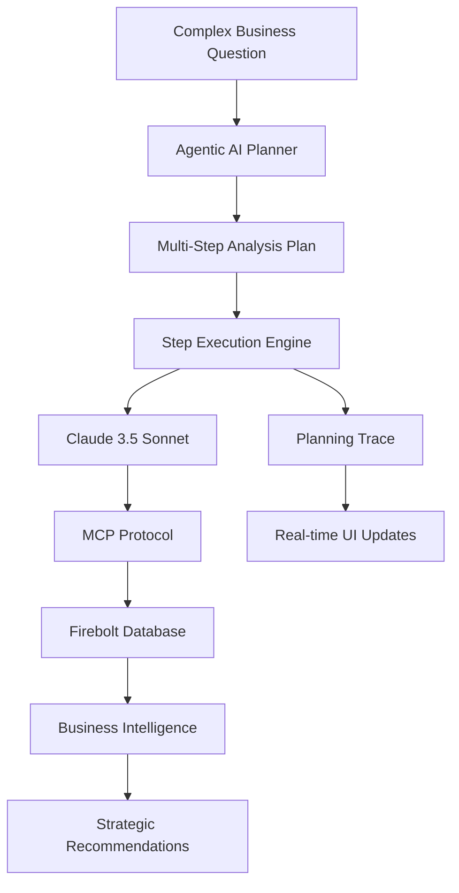

# 🤖 MCP Agentic AI: Advanced Business Intelligence Demos

[](https://asimrout-eng.github.io/mcp-agenticai/)
[](https://python.org)
[](https://streamlit.io)
[](https://anthropic.com)

> **🌐 [View Live Demos](https://asimrout-eng.github.io/mcp-agenticai/)** | **🤖 [Try Agentic AI](https://asimrout-eng.github.io/mcp-agenticai/demos/agentic-ai.html)** | **🧠 [NL2SQL Demo](https://asimrout-eng.github.io/mcp-agenticai/demos/nl2sql.html)**

Two cutting-edge demonstrations showcasing **agentic AI** for business intelligence with Firebolt's lightning-fast analytics platform.

## 🎯 **Two Breakthrough AI Demonstrations**

### 1. 🧠 **Natural Language to SQL**
Transform business questions into optimized SQL queries with Claude AI integration.
- **Real Firebolt connectivity** via MCP protocol
- **Sub-second query execution** with performance tracking
- **Automatic visualizations** with Plotly integration
- **Editable SQL** with syntax highlighting

### 2. 🤖 **Agentic AI Business Intelligence** ⭐ *Featured*
Multi-step autonomous AI reasoning for complex business analysis.
- **🧩 Multi-step planning** - Watch AI break down complex questions
- **👀 Reasoning transparency** - Live planning trace in sidebar
- **🎯 Question adaptation** - Different analysis for different queries
- **💡 Strategic insights** - Business recommendations with confidence scores
- **🎮 Interactive execution** - Step-by-step or automatic analysis

## ✨ **Key Features**

### **🚀 Advanced AI Capabilities**
- **Claude 3.5 Sonnet** integration for intelligent query generation
- **Autonomous reasoning** with hypothesis formation and testing
- **Business context understanding** for strategic recommendations
- **Multi-step analysis workflows** adapted by question type

### **⚡ Enterprise-Grade Performance**  
- **Real Firebolt Integration** via Model Context Protocol (MCP)
- **Sub-second analytics** on columnar data warehouse
- **Dynamic schema discovery** with automatic table detection
- **Performance monitoring** with execution time tracking

### **🎨 Modern User Experience**
- **Beautiful Streamlit interfaces** with responsive design
- **Interactive visualizations** with automatic chart generation
- **Real-time updates** with planning trace visibility
- **Professional UI** suitable for customer demonstrations

## 🚀 **Quick Start**

### **Option 1: Try Live Demos (Recommended)**
Visit **[https://asimrout-eng.github.io/mcp-agenticai/](https://asimrout-eng.github.io/mcp-agenticai/)** for:
- ✅ **Complete documentation** and setup guides
- ✅ **Interactive examples** and use cases  
- ✅ **No installation required** - just explore!

### **Option 2: Run Locally**

```bash
# 1. Clone repository
git clone https://github.com/asimrout-eng/mcp-agenticai.git
cd mcp-agenticai

# 2. Install dependencies  
pip install -r requirements.txt

# 3A. Run Natural Language to SQL Demo
./run.sh your_anthropic_api_key
# Access: http://localhost:8504

# 3B. Run Agentic AI Demo (Featured)
./run_agentic_demo.sh your_anthropic_api_key
# Access: http://localhost:8505
```

**🔐 Security**: API keys are provided as arguments, never stored in files.

## 📁 **Project Structure**

```
mcp-agenticai/
├── 🤖 Agentic AI Demo
│   ├── agentic_ai_demo.py           # Multi-step AI reasoning interface
│   ├── agentic_nl2sql.py            # Enhanced NL2SQL for agent workflows
│   └── run_agentic_demo.sh          # Launch agentic AI demo
│
├── 🧠 Natural Language to SQL
│   ├── app.py                       # NL2SQL Streamlit application
│   ├── nl2sql_claude.py             # Claude API integration
│   └── run.sh                       # Launch NL2SQL demo
│
├── 🔌 Database Integration
│   ├── test_mcp_real.py             # MCP server communication
│   └── requirements.txt             # Python dependencies
│
├── 🌐 GitHub Pages Site
│   └── docs/                        # Professional demo website
│       ├── index.html               # Landing page
│       ├── demos/nl2sql.html        # NL2SQL documentation  
│       └── demos/agentic-ai.html    # Agentic AI guide
│
└── 📚 Documentation
    ├── README.md                    # This file
    ├── AGENTIC_AI_DEMO_README.md    # Detailed agentic AI guide
    └── GITHUB_PAGES_SETUP.md       # Deployment instructions
```

## 🤖 **What Makes This "Agentic"**

### **🧩 Multi-Step Reasoning**
Unlike simple NL2SQL, the agentic AI **autonomously breaks down** complex business questions:
- **Discovers** → **Analyzes** → **Hypothesizes** → **Validates** → **Recommends**
- Each step builds on previous findings
- Adapts analysis approach based on question type

### **👀 Transparent Decision-Making**  
Watch the AI agent's thought process in real-time:
- **Planning trace sidebar** shows step-by-step reasoning
- **Confidence scoring** for each analysis step
- **Insight accumulation** as investigation progresses

### **🎯 Business Intelligence Focus**
Goes beyond data queries to provide strategic value:
- **Revenue optimization** strategies
- **Market expansion** recommendations  
- **Player retention** improvement plans
- **Performance benchmarking** with actionable insights

## 🔧 Configuration

### Environment Variables (Optional)
You can pre-configure credentials via environment variables, or enter them directly in the UI. 
Copy `env_example.txt` to `.env` and update with your credentials:

```env
# Firebolt MCP Server Credentials
FIREBOLT_MCP_ACCOUNT=your_account
FIREBOLT_MCP_DATABASE=your_database  
FIREBOLT_MCP_ENGINE=your_engine
FIREBOLT_MCP_CLIENT_ID=your_service_account_id
FIREBOLT_MCP_CLIENT_SECRET=your_service_account_secret

# Claude API (NOT STORED - API key passed via command line only)
# ANTHROPIC_API_KEY=provided_at_runtime_via_command_line
```

## 🎯 How It Works

1. **Connect**: Enter your Firebolt credentials in the UI (or configure via environment variables)
2. **Discover**: App automatically discovers all tables, columns, DDL, and primary indexes
3. **Ask**: Type your question in natural language
4. **Convert**: Claude AI converts your question to optimized Firebolt SQL  
5. **Edit**: Review and modify the generated SQL if needed
6. **Execute**: Run the query on your live Firebolt database
7. **Analyze**: View results with execution times and auto-generated visualizations

## 💡 **Demo Scenarios**

### **🧠 Natural Language to SQL Examples**
```sql
-- "Show me revenue by country for premium players"
SELECT country, SUM(amount_usd) as revenue 
FROM players p JOIN transactions t ON p.player_id = t.player_id 
WHERE p.is_premium = true GROUP BY country ORDER BY revenue DESC;
```

### **🤖 Agentic AI Business Questions**  
Ask complex, multi-faceted questions and watch the AI agent reason through them:

**Revenue Intelligence:**
*"What's driving our gaming revenue and should we be concerned?"*
→ Agent creates 6-step analysis plan with risk assessment

**Player Analytics:**  
*"How does player engagement correlate with long-term value?"*
→ Agent performs correlation analysis with statistical validation

**Market Strategy:**
*"Which geographic markets should we prioritize for expansion?"*  
→ Agent evaluates opportunities with ROI projections

## 🎯 **Use Cases**

### **For Sales & Marketing Teams**
- **Customer Demonstrations**: Professional AI showcase
- **Territory Analysis**: Geographic performance insights
- **Campaign Optimization**: ROI and conversion analysis

### **For Product & Engineering Teams**
- **Feature Analytics**: User engagement analysis
- **Performance Monitoring**: System optimization insights
- **Technical Showcases**: Advanced AI capabilities

### **For Executive Leadership**
- **Strategic Planning**: Market expansion strategies
- **Investment Decisions**: ROI and growth projections  
- **Competitive Analysis**: Performance benchmarking

## 🏗️ **Architecture**



### **🔧 Technology Stack**

| Component | Technology | Purpose |
|-----------|------------|---------|
| **🤖 AI Engine** | Claude 3.5 Sonnet | Advanced reasoning and SQL generation |
| **⚡ Analytics** | Firebolt | Lightning-fast cloud data warehouse |
| **🔗 Protocol** | MCP (Model Context Protocol) | Secure database connectivity |
| **🎨 Frontend** | Streamlit | Interactive web applications |
| **📊 Visualization** | Plotly | Interactive charts and graphs |
| **🐳 Deployment** | Docker | Containerized MCP server |
| **🌐 Hosting** | GitHub Pages | Professional demo website |


## 🛠️ Development

### Core Files
- `app.py` - Main Streamlit UI and user interaction
- `nl2sql_claude.py` - Claude AI integration and prompt engineering
- `test_mcp_real.py` - MCP server communication and query execution


## 📈 **Performance & Benefits**

### **⚡ Technical Performance**
- **Sub-second queries** on Firebolt's columnar engine
- **Real-time analysis** with live planning trace updates
- **Scalable architecture** ready for enterprise deployment
- **Professional UI** suitable for customer demonstrations

### **💼 Business Value**
- **Faster insights** with natural language interfaces
- **Strategic recommendations** from agentic AI reasoning
- **Improved decision-making** with transparent AI processes  
- **Enhanced productivity** through automated business intelligence

## 🤝 **Contributing & Community**

This project showcases **practical applications of agentic AI** for business intelligence:

- 🐛 **Issues**: [Report bugs or request features](https://github.com/asimrout-eng/mcp-agenticai/issues)
- 💡 **Ideas**: Share suggestions for improvements
- ⭐ **Star**: If you find this useful, give it a star!
- 🔄 **Fork**: Create your own version or contribute back

## 📞 **Resources & Support**

- 🌐 **Live Demos**: [https://asimrout-eng.github.io/mcp-agenticai/](https://asimrout-eng.github.io/mcp-agenticai/)
- 📚 **Firebolt Docs**: [https://docs.firebolt.io/](https://docs.firebolt.io/)  
- 🤖 **Claude AI**: [https://www.anthropic.com/claude](https://www.anthropic.com/claude)
- 🔗 **MCP Protocol**: [Model Context Protocol](https://github.com/modelcontextprotocol)

## 📄 **License**

This project is open source and available under the [MIT License](LICENSE).

---

## 🌟 **Star History**

If this project demonstrates valuable AI applications for your business intelligence needs, please consider starring the repository!

---

**🤖 Built with ❤️ to showcase the future of agentic AI in business intelligence**

[🚀 **Try Live Demos**](https://asimrout-eng.github.io/mcp-agenticai/) | [📖 **Read Documentation**](https://docs.firebolt.io/) | [🤖 **Learn About Agentic AI**](https://asimrout-eng.github.io/mcp-agenticai/demos/agentic-ai.html)