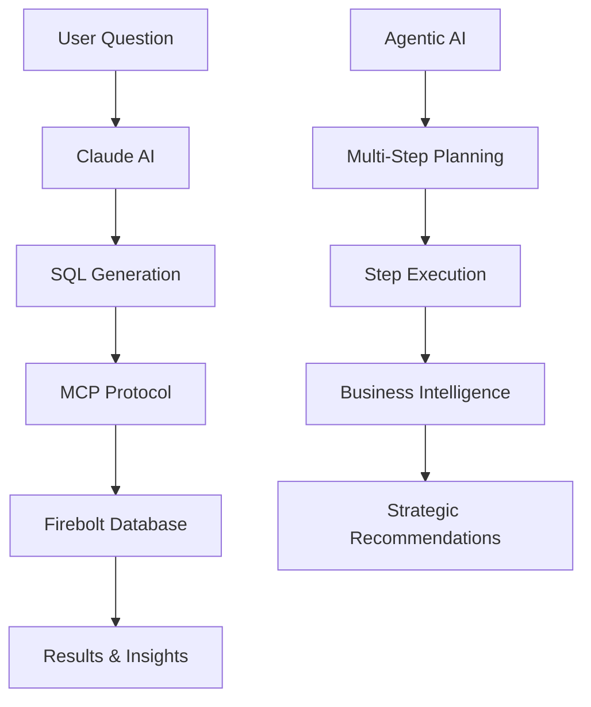

# 🔥 Firebolt AI-Powered Analytics Demos

[](https://asimkumarrout.github.io/mcp-nl-devrel/)
[](https://python.org)
[](https://streamlit.io)
[](https://docker.com)
[](https://anthropic.com)

> **🚀 [View Live Demos](https://asimkumarrout.github.io/mcp-nl-devrel/)**

Two cutting-edge demonstrations showcasing the future of AI-powered business intelligence with Firebolt's lightning-fast analytics platform.

## 🎯 Featured Demos

### 1. 🧠 Natural Language to SQL
Transform business questions into optimized SQL queries using Claude AI with real Firebolt database connectivity.

**Key Features:**
- 💬 Natural language business questions
- 🔥 Real Firebolt database integration via MCP
- ⚡ Sub-second query execution
- 📊 Automatic visualization generation
- ✏️ Editable SQL with syntax highlighting

**[➡️ Try Demo](https://asimkumarrout.github.io/mcp-nl-devrel/demos/nl2sql.html) | [📖 Documentation](./README.md)**

### 2. 🤖 Agentic AI Business Intelligence
Multi-step autonomous AI reasoning for complex business analysis with transparent decision-making.

**Key Features:**
- 🧩 Multi-step reasoning and planning
- 👀 Real-time planning trace visibility
- 🎯 Question-specific analysis workflows
- 💡 Strategic insights and recommendations
- 📊 Confidence scoring for each step
- 🎮 Interactive step-by-step execution

**[➡️ Experience AI Agent](https://asimkumarrout.github.io/mcp-nl-devrel/demos/agentic-ai.html) | [📖 Agent Guide](./AGENTIC_AI_DEMO_README.md)**

## 🚀 Quick Start

### Option 1: Try Online (Recommended)
Visit the **[Live Demo Site](https://asimkumarrout.github.io/mcp-nl-devrel/)** for comprehensive documentation and setup guides.

### Option 2: Run Locally

```bash
# 1. Clone repository
git clone https://github.com/asimkumarrout/mcp-nl-devrel.git
cd mcp-nl-devrel

# 2. Install dependencies
pip install -r requirements.txt

# 3A. Run Natural Language to SQL Demo
./run.sh your_anthropic_api_key
# Access: http://localhost:8504

# 3B. Run Agentic AI Demo
./run_agentic_demo.sh your_anthropic_api_key  
# Access: http://localhost:8505
```

## 🏗️ Architecture



## ⚡ Technology Stack

| Component | Technology | Purpose |
|-----------|------------|---------|
| **Analytics Engine** | Firebolt | Lightning-fast cloud data warehouse |
| **AI Reasoning** | Claude 3.5 Sonnet | Advanced natural language processing |
| **Web Framework** | Streamlit | Interactive web applications |
| **Database Protocol** | MCP (Model Context Protocol) | Secure database connectivity |
| **Containerization** | Docker | MCP server deployment |
| **Visualization** | Plotly | Interactive charts and graphs |

## 📊 Demo Scenarios

### Natural Language Queries
```sql
-- "Show me revenue by country for premium players"
SELECT country, SUM(amount_usd) as revenue 
FROM players p JOIN transactions t ON p.player_id = t.player_id 
WHERE p.is_premium = true 
GROUP BY country ORDER BY revenue DESC;
```

### Agentic AI Analysis
```
Question: "What's driving our revenue growth and what risks should we watch?"

Agent Plan:
1. 🔍 Analyzing current revenue trends
2. 📊 Segmenting by demographics  
3. 📈 Comparing time periods
4. 🎯 Identifying risk factors
5. ✅ Validating with data
6. 💡 Strategic recommendations
```

## 🎮 Interactive Features

### Natural Language to SQL
- **Schema Discovery**: Automatic table and column detection
- **Query Optimization**: AI-generated efficient SQL
- **Performance Tracking**: Real-time execution metrics
- **Visual Analytics**: Auto-generated charts
- **SQL Editing**: Modify queries before execution

### Agentic AI
- **Planning Transparency**: Real-time reasoning visibility
- **Step Control**: Manual or automatic execution
- **Business Context**: Strategic insights generation
- **Confidence Scoring**: Reliability indicators
- **Question Adaptation**: Different analysis for different queries

## 📈 Use Cases

### For Sales Teams
- **Territory Analysis**: "Which regions have the highest growth potential?"
- **Customer Segmentation**: "Show me our most valuable customer segments"
- **Revenue Forecasting**: "Project next quarter's revenue by product line"

### For Product Teams  
- **Feature Analytics**: "How do different features impact user engagement?"
- **User Behavior**: "What drives user retention in our app?"
- **Performance Optimization**: "Which areas need the most improvement?"

### For Executive Leadership
- **Strategic Planning**: "What are our biggest growth opportunities?"
- **Risk Assessment**: "What trends should we be concerned about?"
- **Competitive Analysis**: "How do we compare to industry benchmarks?"

## 🔧 Setup Requirements

### Prerequisites
- **Python 3.8+** with pip and virtual environment
- **Docker Desktop** (for Firebolt MCP server)
- **Anthropic API Key** (for Claude AI integration)
- **Firebolt Account** with service account credentials

### Environment Configuration
```bash
# Required
export ANTHROPIC_API_KEY="your_claude_api_key"

# Optional (can configure in UI)
export FIREBOLT_MCP_CLIENT_ID="your_service_account_id" 
export FIREBOLT_MCP_CLIENT_SECRET="your_service_account_secret"
export FIREBOLT_MCP_ACCOUNT="your_firebolt_account"
export FIREBOLT_MCP_DATABASE="your_database"
export FIREBOLT_MCP_ENGINE="your_engine"
```

## 📚 Documentation

| Resource | Description |
|----------|-------------|
| [**Live Demo Site**](https://asimkumarrout.github.io/mcp-nl-devrel/) | Interactive demos and setup guides |
| [Natural Language Setup](./README.md) | NL2SQL configuration and usage |
| [Agentic AI Guide](./AGENTIC_AI_DEMO_README.md) | Agent setup and scenarios |
| [Firebolt Documentation](https://docs.firebolt.io/) | Database platform guides |
| [Claude AI Documentation](https://docs.anthropic.com/) | AI integration guides |

## 🎯 Key Benefits

### Business Value
- **🚀 Faster Insights**: Sub-second analytics with natural language
- **📊 Better Decisions**: AI-powered strategic recommendations  
- **🔍 Deeper Analysis**: Multi-step reasoning for complex problems
- **⚡ Improved Efficiency**: Automated business intelligence workflows

### Technical Excellence
- **🏗️ Production Ready**: Docker deployment and error handling
- **🔒 Enterprise Security**: Secure credential management
- **📈 Scalable Architecture**: Cloud-native with Firebolt
- **🎨 Modern UI**: Beautiful Streamlit interfaces

## 🤝 Contributing

This repository showcases practical AI applications for business intelligence. Feel free to:

- 🐛 **Report Issues**: Found a bug? Let us know!
- 💡 **Suggest Features**: Have ideas for improvements?
- 🔧 **Submit PRs**: Contributions welcome!
- ⭐ **Star the Repo**: If you find this useful!

## 📞 Support & Contact

- **📧 Issues**: [GitHub Issues](https://github.com/asimkumarrout/mcp-nl-devrel/issues)
- **💼 LinkedIn**: [Asim Kumar Rout](https://linkedin.com/in/asimkumarrout)
- **🐦 Twitter**: [@asimkumarrout](https://twitter.com/asimkumarrout)
- **🔥 Firebolt**: [Official Documentation](https://docs.firebolt.io/)

## 📄 License

This project is open source and available under the [MIT License](LICENSE).

---

## 🌟 Star History

[](https://star-history.com/#asimkumarrout/mcp-nl-devrel&Timeline)

---

**Built with ❤️ to showcase the future of AI-powered analytics**

[🚀 **Try the Live Demos**](https://asimkumarrout.github.io/mcp-nl-devrel/) | [📖 **Read the Docs**](https://docs.firebolt.io/) | [🤖 **Learn About Claude**](https://anthropic.com/claude)
